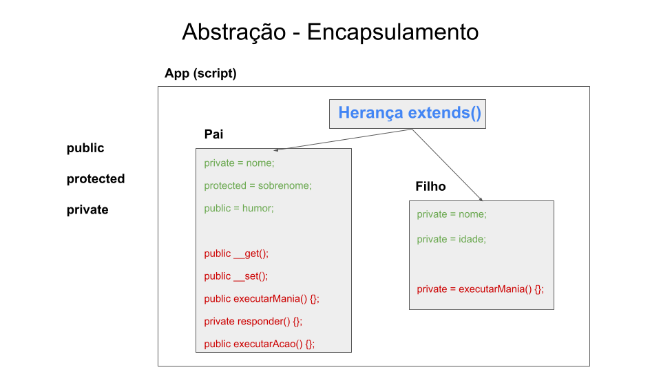
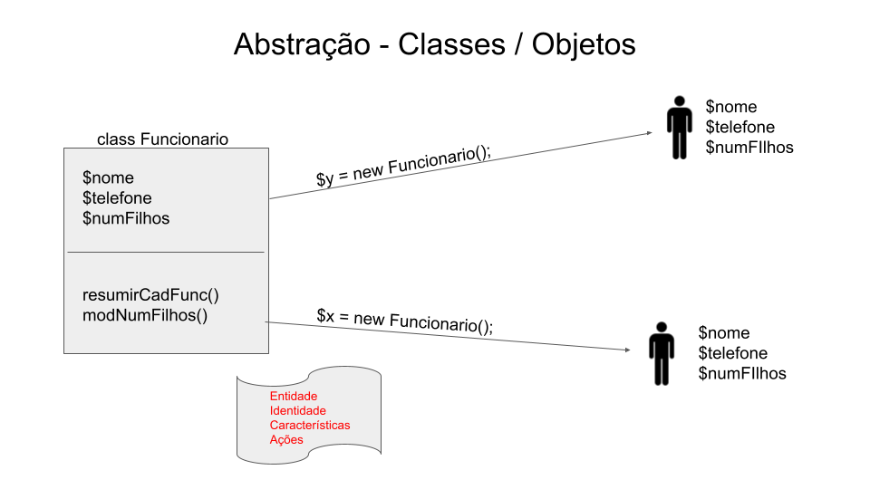

# Desenvolvimento Webcompleto 
Objetivo desse repositório é estudar as seguintes técnologias: HTML5, CSS3, SASS, Bootstrap, JS, ES6, PHP 7, OO, MySQL, JQuery, MVC, APIs, IONIC.

## Indice
<ul style="list-style: none">
    <li><a href="#">Inicio</a></li>
    <li>
        <li>PHP</li>
        <ol>
            <li><a href="#cgi">O que é CGI</a></li>
            <li><a href="#pdo">PHP intermediário PDO</a></li>
        </ol>
    </li>
    <li>
        <li>Mysql<li>
        <ol>
            <li><a href="#mysql">Myql</a></li>
            <li><a href="#how-to-create-db">Como criar um banco usuario no mysql</a></li>
        </ol>
    </li>
</ul>


## CGI que é CGI
<div id="cgi">

    CGI (sigla em inglês para Common Gateway Interface) é uma tecnologia que permite a criação de páginas dinâmicas e interativas na web. Essa tecnologia permite que programas ou scripts sejam executados em um servidor web para gerar conteúdo personalizado em tempo real em resposta a solicitações do usuário.

    Esses programas ou scripts geralmente são escritos em linguagens de programação como Perl, Python, Ruby, entre outras. Eles podem ser usados para criar formulários de envio de informações, páginas de pesquisa, sistemas de comércio eletrônico, entre outras aplicações.

    O CGI é uma das tecnologias mais antigas para a criação de páginas dinâmicas e ainda é amplamente utilizado na web. No entanto, outras tecnologias como o PHP, o ASP.NET e o Java Servlets são agora mais populares do que o CGI para a criação de conteúdo dinâmico na web.
</div>

### Para mais informações:

[Curso CGI introdução ufmg](https://homepages.dcc.ufmg.br/~mlbc/cursos/internet/cgi/intro.htm)

[Curso CGI Introdução fe](https://web.fe.up.pt/~goii2000/M9/cgi.htm#:~:text=CGI%20(Common%20Gateway%20Interface)%2C,tanto%20scripts%20como%20programas%20compilados.)

------------------------------
## PHP OOP - Classes e Objetos
<div id="pdo">
    
    
    
    
</div>


-------------------------
## O que é MYSQL?
<div id="mysql">

    O MySQL é um sistema de gerenciamento de banco de dados relacional (RDBMS) de código aberto amplamente utilizado para armazenar, organizar e gerenciar grandes quantidades de dados. Ele é distribuído sob a licença GPL (General Public License) e pode ser executado em vários sistemas operacionais, incluindo Windows, Linux e macOS.

    O MySQL utiliza a linguagem SQL (Structured Query Language) para consultar e manipular dados em um banco de dados relacional. Ele é capaz de lidar com grandes volumes de dados e é escalável para atender às necessidades de diferentes empresas e organizações. O MySQL também oferece recursos avançados de segurança e backup, permitindo que os usuários protejam seus dados e os recuperem em caso de perda.

    O MySQL é usado em muitos aplicativos da web e é especialmente popular em combinação com a linguagem de programação PHP. Ele é usado para armazenar informações em muitos tipos diferentes de aplicativos, desde pequenos sites pessoais até grandes empresas de comércio eletrônico e organizações governamentais.
</div>

## O Básico sobre a linguagem SQL
<div id="nomeclatura-sql">
    
    Entendendo as nomenclaturas usadas no gerenciamento do MYSQLl e na sua documentação oficial:

    -   DDL - Data Definition Linguage - Linguagem de Definição de Dados

    -   DML - Data Manipulation Linguage - Linguagem de Manipulação de Dados

    -   DCL - Data Control Linguage - Linguagem de Controle de Dados

    -   DTL - Data Transaction Linguage - Linguagem de Transação de Dados

    -   DQL - Data Query Linguage - Linguagem de Consulta de Dados
</div>

## Como criar um usuário para o banco de dados?
<div id="how-to-create-db">
    
    vamos seguir as etapas simples para criar um novo usuário para o nosso banco de dados e aderir privilégios para que o mesmo possa manipular os dados.
</div>

**Etapas:**

1\. Acessar o MYSQL pela linha de comando

2\. Acessar o Banco de Dados como administrador (root)

```shell
$mysql --u root --p
```

3\. Para criar um novo usuário basta digitar:
```sql
CREATE USER 'nomedousuario'@'localhost' IDENTIFIED BY 'senha';
```

 4\. Garanta privilégios ao usuário que foi criado:

```sql
GRANT ALL PRIVILEGES ON \* . \* TO 'nomedousuario'@'localhost';
```

 5\. Para ter efeito imediato:
```sql
 FLUSH PRIVILEGES;
```

 > Uma vez feito isso o usuário foi criado com sucesso e garantimos todos os privilégios ao novo usuário que criamos.

> Nota: garantindo privilégios dessa forma estamos habilitando todos os
> privilégios ao novo usuário que criamos, tenha isso em mente ao usar
> esse comando.


### Garantindo privilégios separadamente para o usuário do Mysql

-   CREATE - habilita o usuário a criar um banco de dados ou tabelas

-   SELECT - permite o usuário requirir os dados

-   INSERT - permite o usuário adicionar novos usuários as tabelas

-   UPDATE - permite que usuários modifiquem as entradas nas tabelas
    existentes

-   DELETE - habilita o usuário a remover entradas das tabelas

-   DROP - permite que o usuário delete entradas, banco de dados e
    tabelas


### Adicionando privilégios separadamente
Para usar qualquer uma dessa opções, basta substituir o PERMISSION_TYPE
por qualquer um dos comandos propriamente descritos acima. Para aplicar
múltiplos privilégios, separe-os com virgula. Por exemplo, podemos
assinar CREATE e SELECT para o usuário não-root do MYSQL com esse
comando:
```sql
GRANT SELECT, CREATE ON \* . \* TO 'usuario'@'localhost';
```

Algumas vezes você pode querer retirar alguns privilégios de usuário e
para isso basta digitar:
```sql
REVOKE PERMISSION_TYPE ON database_name.table_name FROM 'nomedeusuario'@'localhost'
```

Por exemplo podemos remover todos os privilégios da seguinte forma:
```sql
REVOKE ALL PRIVILEGES ON \* . \* FROM 'nomedeusuario'@'localhost';
```

E finalmente podemos deletar todo banco de dados:
```sql
DROP USER 'nomedeusuario'@'localhost';
```

**Nota:** Lembre-se que você precisa ter privilégios de root para usar
esses comandos. Você também sempre pode usar o FLUSH PRIVILEGES para ter
efeito imediato depois que fizer suas alterações.


### Mostrando os privilégios de usuário parar um usuário do MYSQL
```sql
SHOW GRANTS FOR 'nomedeusuario'@'localhost';
```